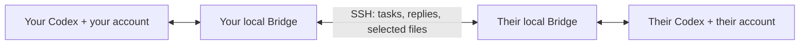

# Codex Bridge

Let two people's Codex installations exchange project tasks, questions, results, and selected files over an existing SSH connection.

**Each person keeps their own Codex account, files, and permissions.** Pair the computers once, then create a collaboration session for each project.

This is an independent community project, not an official OpenAI product.

## How it works



Bridge uses a local MCP connector and the [Codex App Server](https://learn.chatgpt.com/docs/app-server). Authentication and execution stay on each person's computer.

## Do we need the same Codex account?

**No.** Both people sign into their own local Codex installation. Bridge does not copy account tokens, SSH private keys, or browser sessions.

A collaboration session links **two local conversations**, created when each computer first receives a task. It does not mirror all chats between accounts. Each person can ask their Codex to use the Bridge tools and read the shared project's results.

The desktop and Bridge cannot write to the same conversation at the same time. This release closes each Bridge worker after its turn so the desktop can take over. If the desktop already owns that conversation, Bridge reports `conversation_in_use`. See [finding and opening chats](docs/SETUP.md#find-your-project-chat).

## Before you start

On **both computers** you need:

- Windows, Python **3.11+**, and a working local Codex sign-in.
- A supported Codex executable: **0.153.4** or **0.155.0-alpha.2.6**.
- An existing SSH route from one computer to the other, with a verified host key and forwarding permitted.

**Compatibility-limited preview:** other Codex versions stop with a clear error until their App Server schemas are reviewed. macOS/Linux deployment has not been verified. Codex usage follows each person's own account; Bridge does not supply model access.

## Set up two computers

Use the same source on both computers. You do **not** need two different programs.

| Step | Computer A | Computer B |
| --- | --- | --- |
| 1. Install | Install Bridge and register its MCP tools | Same |
| 2. Configure | Generate local configuration as `computer-a` | Generate it as `computer-b` |
| 3. Pair | Export an invitation; import B's invitation | Export an invitation; import A's invitation |
| 4. Connect | Start Bridge and its SSH supervisor | Start the local Bridge |
| 5. Select a project | Choose A's workspace and permissions | Choose B's workspace and permissions |
| 6. Test | Send a harmless task and wait for its result | Send a reply/task back |

**Follow the [step-by-step setup guide](docs/SETUP.md).** It includes the exact commands. Start with a disposable sample project before authorizing edits to real work.

Each computer generates its own private `~/.codex-bridge/config.json` and MCP launcher. The [Computer A](examples/computer-a.example.json) and [Computer B](examples/computer-b.example.json) files explain the differences; they contain no usable credentials.

## Use it

After setup, open a fresh Codex chat on either computer and ask:

> Use Codex Bridge. Check the peer, create or reuse the collaboration session for sample-project, and ask the other computer to read its project README and summarize it. Wait for the result. Keep follow-ups in that same session.

Use **one session per ongoing project**. A second project needs new local workspace selections and a new session, not another installation. Requests and replies work in both directions.

| Tools | What they do |
| --- | --- |
| `peer_status` | Check availability and capabilities |
| `session_create`, `session_list`, `session_get` | Select and inspect project conversations |
| `session_context_update` | Keep the goal, context, and responsibilities current |
| `task_send`, `task_status`, `task_wait`, `task_cancel` | Assign work and follow its progress |
| `message_send` | Send a question, clarification, note, or result |
| `artifact_send`, `artifact_fetch` | Transfer a selected file with SHA-256 verification |

Transferred files are limited to **8 MiB per artifact**. Only files inside the project's configured export/import folders can be transferred.

## Start and stop

On each PC:

```powershell
$bridge = Join-Path $env:USERPROFILE 'plugins\codex-bridge\scripts\bridge.ps1'
& $bridge start
& $bridge status
& $bridge stop
```

On **Computer A**, also use `& $bridge transport-start` after starting Bridge. Use `transport-stop` to stop its forwarding. Setup selects the Windows interactive launcher; its owner must remain signed in. No automatic startup is installed.

`stop` ends local Bridge work and releases its worker conversations. It preserves files, pairing, and history. A completed Codex turn can still report a failed task—check the returned result.

## More information

- [Setup, new projects, chat visibility, and common errors](docs/SETUP.md)
- [Plan for two new users and future onboarding improvements](docs/ONBOARDING-PLAN.md)
- [Optional plugin installation, fixed actions, revocation, and removal](docs/ADVANCED.md)
- [Security boundaries](docs/SECURITY.md)
- [Tests and what has actually been verified](docs/TESTING.md)

Run the tests without Codex credentials or a remote computer:

```powershell
python -m unittest discover -s tests -v
```

## License

[MIT](LICENSE).
